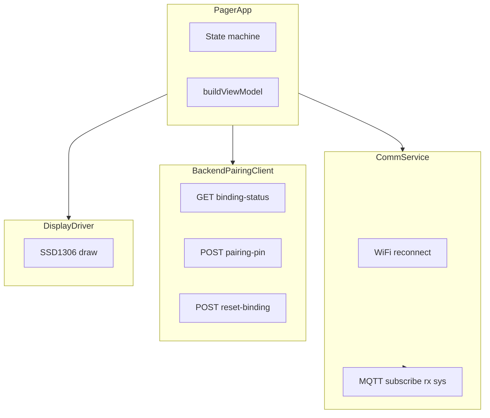

# Smart Retro Pager — прошивка (ESP8266 / NodeMCU)

PlatformIO-проект для NodeMCU v3 (Lolin): Wi‑Fi, MQTT, OLED SSD1306 128×64, кнопки, зуммер, **Phase 4A** (pairing по HTTP + EEPROM + `sys`) и **Phase 5A** (локальная история последних rx-сообщений в RAM).

## Сборка и прошивка

```bash
cd Pager
pio run
pio run -t upload   # при подключённой плате
pio device monitor  # Serial 115200
```

Требуется поддержка ESP8266 в PlatformIO (платформа `espressif8266`, см. [platformio.ini](platformio.ini)).

## Документация по железу

См. в репозитории [docs/pager_hardware_phase1_context.md](../docs/pager_hardware_phase1_context.md) и контекст Phase 4A в [docs/phase4a_pairing_lifecycle_context.md](../docs/phase4a_pairing_lifecycle_context.md).

## Настройка (`include/config.h`)

| Константа | Назначение |
|-----------|------------|
| `WIFI_SSID`, `WIFI_PASSWORD` | Домашняя Wi‑Fi сеть |
| `MQTT_HOST`, `MQTT_PORT` | Брокер Mosquitto (LAN IP, **не** `localhost` с точки зрения платы) |
| `BACKEND_HOST`, `BACKEND_PORT` | Spring Boot pairing API (LAN IP ПК с backend, **не** `localhost`) |
| `TELEGRAM_BOT_HANDLE` | **Только подпись на OLED** в экране pairing (строка рядом с TTL), чтобы пользователь знал, куда писать `/bind …`. **Не** участвует в HTTP/MQTT/Telegram API на устройстве — меняете на реальный `@your_bot` для удобства. |
| `ENABLE_LOCAL_MOCK_MESSAGE` | Если `true`, в IDLE кнопка OK подставляет тестовое сообщение без брокера |
| `PIN_REFRESH_RETRY_INTERVAL_MS` | Пауза между повторными запросами PIN при ошибке backend |
| `FACTORY_RESET_HOLD_MS` | Удержание UP+DOWN для factory reset |
| `HISTORY_SIZE` | Сколько последних rx-сообщений хранить в RAM (5) |
| `HISTORY_MESSAGE_MAX_LEN` | Макс. длина одного сообщения в истории (256) |
| `HISTORY_PREVIEW_MAX_LEN` | Длина превью в списке истории на OLED (18) |

## Зависимости (PIO)

Указаны в `platformio.ini`: Adafruit SSD1306, Adafruit GFX, PubSubClient, ArduinoJson 6.x. Из ядра ESP8266: Wi‑Fi, HTTPClient, EEPROM, Wire.

`MQTT_MAX_PACKET_SIZE=512` задаётся через `build_flags` (см. `platformio.ini`), чтобы входящие MQTT-пакеты до `RX_MESSAGE_MAX_LEN` помещались в буфер PubSubClient.

---

## Архитектура (слои)

Прошивка разбита на **пять** логических уровней (зависимости направлены **сверху вниз**):

| Слой | Каталог / файлы | Роль |
|------|-----------------|------|
| **Вход** | `src/main.cpp` | `setup()` / `loop()` делегируют в `PagerApp`. |
| **Приложение** | `src/business/pager_app.cpp`, `include/business/pager_app.h` | Конечный автомат, сценарии boot/pairing/sys/factory reset, сборка `PagerViewModel`, порядок шагов в `loop()`. |
| **Сервисы** | `src/services/*`, `include/services/*` | `BackendPairingClient` — синхронные HTTP-запросы к REST; `MessageService` + `TextLayoutService` — текст и вёрстка; `eeprom_binding_store` — кэш `bound`. |
| **Коммуникация** | `src/communication/comm_service.cpp` | Неблокирующий Wi‑Fi (`WiFi.begin` с интервалом `NETWORK_RETRY_INTERVAL_MS`) и MQTT (`mqttClient.loop()` только при `connected()`), подписки, callback → буферы. |
| **Драйверы** | `src/drivers/*` | OLED (Adafruit SSD1306), кнопки с debounce, зуммер по таймерам `millis()`. |

Типы состояний и модель для экрана: `include/pager_types.h` (`SystemState`, `PagerViewModel`, `TextLayout`).



---

## Реализация: главный цикл `PagerApp::loop()`

Один проход `loop()` выполняет шаги **в фиксированном порядке** (без долгих `while` внутри приложения):

1. **`commService_.loop()`** — обновление Wi‑Fi/MQTT и `mqttClient.loop()`.
2. **Первый коннект Wi‑Fi** — один раз `runPostWifiSequenceOnce_()`: GET binding-status, ветвление, при необходимости POST pairing-pin (см. ниже).
3. **`applyIncomingRx_()`** — если в очереди есть payload с `rx`, перенос в `MessageService`, переход в `STATE_READING`, beep «входящее».
4. **`applySysCommands_()`** — разбор `MqttSysCommand` из очереди `sys` (`BIND_SUCCESS` / `UNBOUND`).
5. **`updatePairingPinLifecycle_()`** — истечение TTL PIN, повторный запрос с учётом backoff.
6. **`tryFactoryResetHold_()`** — неблокирующая проверка удержания UP+DOWN.
7. **Кнопки** → `processLogic_()` — переходы состояний, прокрутка в READING.
8. **`buzzerDriver_.update()`** — неблокирующая «мелодия» кликов/входящих/success.
9. **OLED** — если `uiDirty_` или прошло ≥ `DISPLAY_UPDATE_INTERVAL_MS` (150 ms), `drawUI_()` → `DisplayDriver::drawUI(PagerViewModel)`.

Так сохраняется регулярный вызов `mqttClient.loop()`; HTTP вызывается **редко** и синхронно (timeout 3 s), что допустимо по ТЗ Phase 4A.

---

## Конечный автомат (`SystemState`)

| Состояние | Назначение |
|-----------|------------|
| `STATE_BOOT` | Зарезервировано в enum; фактический старт после инициализации — `STATE_CONNECTING`. |
| `STATE_CONNECTING` | Ожидание Wi‑Fi; на OLED — экран «Connecting WiFi…». |
| `STATE_PAIRING` | Показ PIN с backend, обратный отсчёт TTL, «Refreshing PIN…», при ошибке — текст как у pairing error. |
| `STATE_IDLE` | Ожидание сообщений; строки Wi‑Fi / MQTT / Backend / bound и хвост `deviceId`. |
| `STATE_READING` | Просмотр `currentMessage` с прокруткой UP/DOWN, OK — выход в IDLE. |
| `STATE_ERROR` | Backend недоступен при unbound-сценарии; периодический retry PIN через lifecycle + backoff. |

Переход **PAIRING → IDLE по OK** убран: привязка обязательна до `BIND_SUCCESS` (OK в PAIRING только даёт короткий click beep).

---

## Boot после Wi‑Fi (`runPostWifiSequenceOnce_`)

Выполняется **ровно один раз** после первого успешного `WiFi.status() == WL_CONNECTED`:

- **GET** `/api/v1/devices/{deviceId}/binding-status` → поле `bound`.
- При **успешном HTTP**: состояние синхронизируется с backend, `saveBoundStateToEEPROM(bound)`, `commService_.setDeviceBoundForRx(bound)`. Если `bound == true` — очистка PIN, `STATE_IDLE`. Если `false` — **POST** pairing-pin, заполнение `currentPin_`, TTL, `pinReceivedAtMillis_`, `STATE_PAIRING`.
- При **ошибке HTTP**: если в EEPROM при старте был `bound` — доверяем кэшу: `STATE_IDLE`, `backendReachable = false` (индикатор Backend OFF). Иначе — попытка POST PIN; при провале — `STATE_ERROR` и backoff.

`deviceId`: MAC без `:`, **uppercase** (как на backend), общий для URL и топиков — см. `CommService::refreshDeviceId_()`.

---

## EEPROM (кэш, не источник истины)

Реализация: `include/services/eeprom_binding_store.h`.

- Байт 0: магия `0x42`; байт 1: `0x01` / `0x00` = bound / unbound.
- `EEPROM.begin(EEPROM_SIZE)` в `PagerApp::begin()`.
- `saveBoundStateToEEPROM` пишет и делает `commit` **только если** значение реально изменилось (меньше износа flash).

---

## HTTP (`BackendPairingClient`)

Класс без собственного состояния соединения: на каждый вызов создаётся локальный `WiFiClient`, `HTTPClient`, `http.begin(client, url)`, `http.setTimeout(3000)`.

| Метод | Endpoint | Назначение |
|-------|----------|------------|
| `fetchBindingStatus` | GET `.../binding-status` | Поле `bound` (JSON, `StaticJsonDocument<384>`). |
| `requestPairingPin` | POST `.../pairing-pin` | Тело `{}`; поля `pin`, `ttlSeconds`. |
| `postResetBinding` | POST `.../reset-binding` | Factory reset; успех по HTTP 2xx. |

Подробные URL и ответы дублируются в Serial (см. логи в `.cpp`).

---

## MQTT (`CommService`)

- Топики: `pager/{deviceId}/rx`, `pager/{deviceId}/sys` — подписка после каждого успешного `mqtt.connect` (в т.ч. после reconnect).
- **Callback** по `strcmp` с заранее собранными строками `topicRx_` / `topicSys_`.
- **`rx`**: payload копируется в `rxBuffer_`, выставляется `rxPending_`, **только если** `setDeviceBoundForRx(true)` — иначе пакет отбрасывается с логом (устройство не привязано).
- **`sys`**: короткий буфер (~32 байта), `sysPending_`; `takePendingSysCommand()` читает, trim пробелы/переводы строк, сравнение с `BIND_SUCCESS` и `UNBOUND`.

Очередь «на один кадр»: `takeRxPayload` / `takePendingSysCommand` снимают флаг после чтения (критичные секции с `noInterrupts`/`interrupts` вокруг снятия флага для `rx`).

---

## PIN: TTL и повторные запросы

- TTL считается от **`millis()`** в момент успешного ответа: `pinReceivedAtMillis_` + `pinTtlSeconds_` (секунды → миллисекунды).
- **`isPairingPinExpired_` / `getPairingPinRemainingSeconds_`** — для отображения `MM:SS` на OLED.
- При истечении TTL выполняется новый POST pairing-pin; **throttle** `PIN_REFRESH_RETRY_INTERVAL_MS` применяется после **неуспешного** HTTP (`pinHttpFailBackoff_`); при истечении TTL throttle **обходится**, чтобы не застревать без PIN.

---

## Системные команды MQTT (`sys`)

Обрабатываются в `PagerApp::applySysCommands_` после применения `rx`:

- **`BIND_SUCCESS`**: EEPROM `true`, `isBound_`, `setDeviceBoundForRx(true)`, очистка PIN, `STATE_IDLE`, короткий flash «BOUND OK», `BuzzerDriver::startSuccessBeep()`.
- **`UNBOUND`**: EEPROM `false`, сброс привязки на стороне логики устройства, новый POST PIN, переход в PAIRING или ERROR при сбое сети.

---

## Factory reset (железо)

- Условие: одновременно **низкий** уровень на GPIO UP и DOWN (сырой `digitalRead`, не debounced-события), удержание ≥ `FACTORY_RESET_HOLD_MS` (5 s), только в `IDLE` / `PAIRING` / `ERROR`.
- После срабатывания — флаг «ждём отпускания обеих кнопок», чтобы не повторять reset в цикле.
- **POST** `reset-binding`; при ошибке backend — лог + локальный `saveBoundStateToEEPROM(false)` по ТЗ, flash «RST: no ACK» на IDLE в течение нескольких секунд.

---

## UI и отрисовка

- **`PagerViewModel`** — снимок состояния для одного кадра: никакой отрисовки внутри домена, только данные (`include/pager_types.h`).
- **`DisplayDriver`** — по `viewModel.state` выбирает экран (BOOT / CONNECTING / PAIRING / IDLE / READING / ERROR); не держит бизнес-логики.
- Обновление экрана ограничено **150 ms** или немедленно при `uiDirty_` (смена состояния, скролл, новый PIN).

---

## Зуммер (`BuzzerDriver`)

Конечный автомат фаз «импульс / пауза» на `millis()`: click (1 импульс), incoming (3), success (2 коротких импульса с другими длительностями). Не использует `delay()` в `loop()`.

---

## Краткий указатель файлов

| Файл | Содержание |
|------|------------|
| `src/main.cpp` | Точка входа Arduino. |
| `src/business/pager_app.cpp` | Автомат, boot, sys, PIN lifecycle, factory reset, `loop()`. |
| `src/communication/comm_service.cpp` | Wi‑Fi/MQTT, `deviceId`, топики, callback. |
| `src/services/backend_pairing_client.cpp` | HTTP + JSON. |
| `src/services/eeprom_binding_store.cpp` | EEPROM. |
| `src/services/message_service.cpp` | Текст сообщения и layout для READING. |
| `src/drivers/display_driver.cpp` | Все экраны OLED. |

После изменения `config.h` пересоберите проект (`pio run`).
