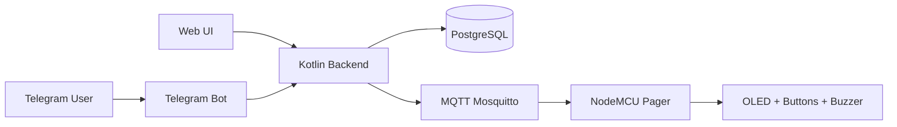
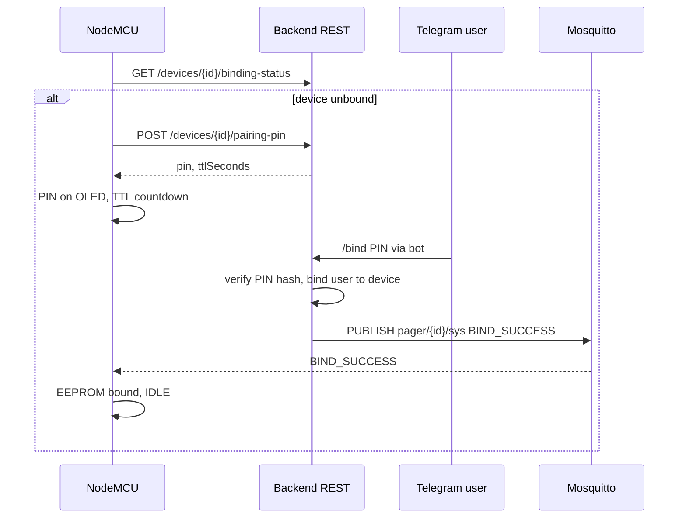
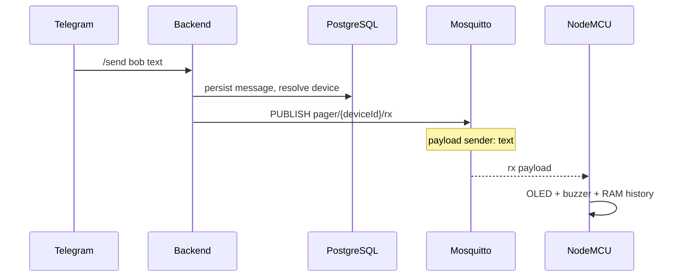
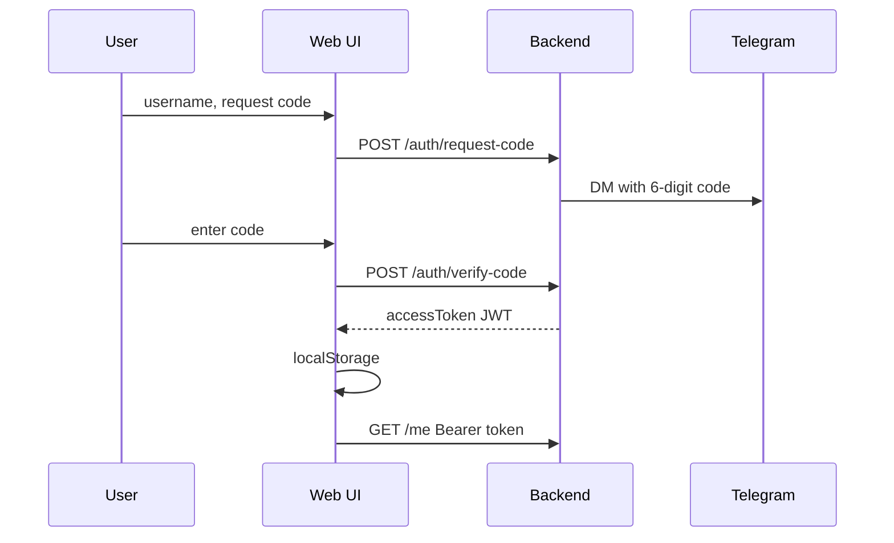

# Smart Retro Pager

**Smart Retro Pager** — учебный IoT‑MVP: пейджер на **NodeMCU v3 (ESP8266)** с OLED **SSD1306 128×64**, кнопками и зуммером получает текст по **MQTT** и показывает его на дисплее. Отправка возможна через **Telegram‑бота** и **веб‑интерфейс**. **Backend** на **Kotlin (Spring Boot 3)** хранит пользователей, устройства и историю сообщений в **PostgreSQL**, публикует в **Eclipse Mosquitto**. Устройство поддерживает **HTTP‑pairing** с временным PIN, **кэш привязки в EEPROM**, **локальную RAM‑историю** последних сообщений и **системные команды** по MQTT.

---

## Содержание

1. [Описание проекта](#описание-проекта)
2. [Возможности MVP](#возможности-mvp)
3. [Архитектура](#архитектура)
4. [Основные сценарии](#основные-сценарии)
5. [Железо](#железо)
6. [Прошивка (Firmware)](#прошивка-firmware)
7. [Инфраструктура Docker](#инфраструктура-docker)
8. [Backend](#backend)
9. [Telegram‑бот](#telegram-бот)
10. [Web UI](#web-ui)
11. [REST API](#rest-api)
12. [MQTT‑топики](#mqtt-топики)
13. [Демонстрационные сценарии](#демонстрационные-сценарии)
14. [Устранение неполадок](#устранение-неполадок)
15. [Замечания по безопасности](#замечания-по-безопасности)
16. [Ограничения MVP](#ограничения-mvp)
17. [Дальнейшее развитие](#дальнейшее-развитие)
18. [Структура репозитория](#структура-репозитория)
19. [Авторы и лицензия](#авторы-и-лицензия)

---

## Описание проекта

Система связывает **человека в Telegram / в браузере**, **облачный backend** и **физическое устройство** в одной Wi‑Fi сети с доступом к MQTT‑брокеру.

**Задача:** доставлять короткие текстовые уведомления на «ретро»‑пейджер с минимальной инфраструктурой (Docker + один JAR/контейнер backend).

**User story:** студент включает пейджер, привязывает его к своему Telegram через PIN на экране, после чего друзья отправляют сообщения командой `/send` или через веб‑страницу — текст появляется на OLED, срабатывает зуммер; на устройстве можно листать длинный текст и смотреть последние несколько сообщений в локальной истории.

---

## Возможности MVP

### Устройство (прошивка в каталоге `Pager/`)

- Подключение и переподключение **Wi‑Fi** и **MQTT**
- **deviceId** из MAC‑адреса (без двоеточий, **верхний регистр**), общий для REST и топиков
- Подписка на `pager/{deviceId}/rx` и `pager/{deviceId}/sys`
- Отображение входящих сообщений, **прокрутка** длинного текста, **зуммер**
- **Локальная история** последних **5** сообщений в RAM
- Экран **pairing PIN** с **обратным отсчётом TTL** и повторным запросом PIN
- Проверка **binding-status** у backend после подключения к Wi‑Fi
- **EEPROM**: кэш флага «привязан / нет» (не источник истины при расхождении с сервером в части сценариев — см. прошивку)
- **Factory reset**: удержание **UP + DOWN** (по умолчанию **5 с**) в допустимых состояниях → `POST .../reset-binding`
- Обработка **sys**: `BIND_SUCCESS`, `UNBOUND`

### Backend

- **Kotlin**, **Spring Boot 3**, **PostgreSQL**, миграции **Flyway**
- **REST API**, публикация в MQTT (**Eclipse Paho**), QoS **1**
- Жизненный цикл **pairing**: PIN с **TTL**, PIN в БД как **хэш**
- **Telegram Bot**: привязка `/bind`, `/unbind`, отправка, история, список устройств
- Правило MVP: **отправителю не нужен свой пейджер**; **получатель** должен иметь **привязанное** устройство (для `/send username`)
- **Web auth**: одноразовый код в Telegram → **JWT** для `/api/v1/me/**`
- Статическая **Web UI** (`/`, `app.js`, `styles.css`)
- Публичные **debug/demo** эндпоинты (пользователи, сообщения по `deviceId`, список устройств) **без JWT** — удобно для лабораторной, не для продакшена

### Telegram

Команды: `/start`, `/help`, `/me`, `/bind PIN`, `/unbind`, `/send username текст`, `/send_device deviceId текст`, `/history`, `/devices` (подробнее в разделе [Telegram‑бот](#telegram-бот)).

### Web UI

- **Vanilla** HTML/CSS/JS
- Вход: username → код в Telegram → JWT в **localStorage** (`smartPagerAccessToken`)
- Профиль, устройства, история, отправка по username, выход

---

## Архитектура

**Компоненты:**

- **Telegram User** — клиент мессенджера; взаимодействует с ботом (команды, код входа в Web).
- **Telegram Bot** — long polling к Bot API; логика в Spring‑сервисах backend.
- **Web UI** — статика с хоста backend; вызывает REST (auth + `me`).
- **Kotlin Backend** — бизнес‑логика, БД, MQTT publisher, интеграция с Telegram.
- **PostgreSQL** — пользователи, устройства, PIN (хэш), сообщения, коды веб‑входа.
- **Mosquitto** — брокер MQTT; устройство и backend подключаются к **одному** брокеру (в Docker — сервис `mosquitto`, порт **1883** на хосте).
- **NodeMCU Pager** — прошивка `Pager/`: Wi‑Fi, HTTP к backend, MQTT, UI на OLED.



---

## Основные сценарии

### Pairing (привязка устройства к Telegram)



### Доставка сообщения (пример: Telegram `/send`)



### Вход в Web UI (одноразовый код + JWT)



---

## Железо

### Компоненты

| Компонент | Назначение |
|-----------|------------|
| NodeMCU v3 Lolin (ESP8266) | MCU, Wi‑Fi, GPIO |
| OLED SSD1306 128×64, I2C | Вывод текста и UI |
| 3× тактовая кнопка | UP / DOWN / OK |
| Активный зуммер | Звук уведомления |
| Провода, макетная плата (по желанию) | Сборка |

### Подключение (согласовано с `Pager/include/config.h`)

**OLED (I2C)**

| OLED | NodeMCU |
|------|---------|
| GND | GND |
| VCC / VDD | 3V3 |
| SCL / SCK | **D1** (GPIO5) |
| SDA | **D2** (GPIO4) |

**Кнопки** (вторая ножка каждой кнопки на **GND**; в прошивке используется **INPUT_PULLUP**)

| Кнопка | GPIO |
|--------|------|
| UP | **D5** (GPIO14) |
| DOWN | **D6** (GPIO12) |
| OK | **D7** (GPIO13) |

**Зуммер (активный)**

| Зуммер | NodeMCU |
|--------|---------|
| + | **D8** (GPIO15) |
| − | GND |

**Важно:** в `MQTT_HOST` и `BACKEND_HOST` на ESP8266 нужно указывать **IP компьютера в LAN** (например `192.168.1.45`), а не `localhost` / `127.0.0.1`: с точки зрения платы «localhost» — сама плата, а не ваш ПК с Docker.

---

## Прошивка (Firmware)

### Где находится код

Прошивка — это проект **PlatformIO** в каталоге **`Pager/`** (C++/Arduino framework для ESP8266). Точка входа: `Pager/src/main.cpp`, логика приложения: `Pager/src/business/pager_app.cpp`.

### Зависимости

В **`Pager/platformio.ini`** подключены библиотеки:

- **Adafruit SSD1306**, **Adafruit GFX** — дисплей
- **PubSubClient** — MQTT
- **ArduinoJson** 6.x — разбор JSON от backend

Из **ядра ESP8266** (через PlatformIO / Arduino framework) используются в том числе: **ESP8266WiFi**, **ESP8266HTTPClient**, **Wire**, **EEPROM**.

> **TODO:** если преподаватель ожидает «чистый Arduino IDE» и список `#include` в одном `.ino`, в этом репозитории используется **PlatformIO** и несколько `.cpp` файлов — эквивалентные модули те же.

### Настройка (`Pager/include/config.h`)

| Константа | Назначение |
|-----------|------------|
| `WIFI_SSID`, `WIFI_PASSWORD` | Домашняя Wi‑Fi сеть |
| `MQTT_HOST`, `MQTT_PORT` | Mosquitto (**LAN IP** машины с брокером) |
| `BACKEND_HOST`, `BACKEND_PORT` | Spring Boot (**LAN IP**, порт **8080** по умолчанию) |
| `TELEGRAM_BOT_HANDLE` | Только **подпись на OLED** (например `@MyPagerBot`), подсказка пользователю |

Дополнительные тайминги и размер истории см. в [Pager/README.md](Pager/README.md).

### Сборка, прошивка, Serial Monitor

Из корня репозитория:

```bash
cd Pager
pio run
pio run -t upload
pio device monitor
```

Скорость UART в проекте: **115200** (`monitor_speed` в `platformio.ini`).

### Как узнать `deviceId`

После прошивки откройте монитор порта: при инициализации в логе фигурирует **MAC без двоеточий в верхнем регистре** — это и есть `deviceId` для REST и MQTT (совпадает с логикой `CommService` в прошивке). Его же можно увидеть на экране в режиме **IDLE** (хвост строки состояния).

---

## Инфраструктура Docker

В корне репозитория — **`docker-compose.yml`**: сервисы **postgres**, **mosquitto**, **backend**.

### Запуск всего стека

```bash
docker compose up -d --build
docker ps
```

Ожидаемые контейнеры: `pager-postgres`, `pager-mosquitto`, `pager-backend`. API: `http://localhost:8080`.

Перед запуском задайте переменные окружения для Telegram и секретов (см. [Backend](#backend)); для чистой проверки MQTT без бота можно поднять стек, но бот и веб‑код не будут работать без `TG_BOT_TOKEN`.

### Только PostgreSQL и Mosquitto (backend локально)

```bash
docker compose up -d postgres mosquitto
cd backend
./gradlew bootRun
```

### PostgreSQL (из compose)

- База: `pager_db`
- Пользователь: `pager_user`
- Пароль: `pager_password`
- Порт на хосте: **5432**

### Mosquitto

- Конфиг монтируется из **`mqtt/config/`** (файл **`mosquitto.conf`**): слушатель **1883**, `allow_anonymous true` (MVP), persistence в volume.
- Папки **`mqtt/data`**, **`mqtt/log`** — данные и логи брокера на хосте.

### IP для NodeMCU

ПК и NodeMCU должны быть в **одной Wi‑Fi сети**. В `MQTT_HOST` / `BACKEND_HOST` укажите **LAN‑IP этого ПК** (тот же адрес, по которому с телефона открывается `http://IP:8080` в той же сети, если файрволл позволяет).

---

## Backend

### Требования

- **JDK 17+** (для сборки в Dockerfile используется **17**; на macOS при нескольких JDK может понадобиться `export JAVA_HOME=...`).
- **Docker** с Compose v2.
- **Gradle** — обёртка **`backend/gradlew`** (отдельная установка Gradle не обязательна).

### Переменные окружения (важные)

| Переменная | Назначение |
|------------|------------|
| `TG_BOT_TOKEN` | Токен BotFather; если пусто — бот не регистрируется (Telegram отключён). |
| `TG_BOT_USERNAME` | Имя бота (документация / отображение). |
| `PAIRING_PIN_SALT` | Соль для хэша PIN (в `application.yml` есть dev‑заглушка — смените для демо). |
| `WEB_AUTH_CODE_SALT` | Соль для хэша одноразового кода веб‑входа. |
| `WEB_AUTH_JWT_SECRET` | Секрет **HMAC HS256** для JWT (**не короче 32 символов** в реальной среде). |

В Docker Compose эти переменные пробрасываются из окружения хоста (`${VAR:-}`).

### Запуск

**Вариант A — всё в Docker**

```bash
export TG_BOT_TOKEN="..."
export TG_BOT_USERNAME="my_pager_bot"
export PAIRING_PIN_SALT="..."
export WEB_AUTH_CODE_SALT="..."
export WEB_AUTH_JWT_SECRET="минимум-32-символа-для-jwt"
docker compose up -d --build
```

**Вариант B — backend на хосте, БД и MQTT в Docker**

```bash
docker compose up -d postgres mosquitto
cd backend
./gradlew bootRun
```

Профиль по умолчанию подключается к `localhost:5432` и `localhost:1883` (см. `application.yml`). В контейнере backend активен профиль **`docker`**: хосты `postgres` и `mosquitto` (`application-docker.yml`).

### Обзор `application.yml`

| Блок | Смысл |
|------|--------|
| `server.port` | **8080** |
| `spring.datasource.*` | PostgreSQL (localhost в dev) |
| `spring.flyway.enabled` | Миграции схемы |
| `mqtt.*` | URL брокера, `client-id`, QoS |
| `pairing.pin-ttl-seconds` | **300** с TTL PIN |
| `pairing.pin-length` | **6** цифр |
| `web-auth.code-ttl-seconds` | **300** с для кода входа в Web |
| `web-auth.jwt-ttl-seconds` | **3600** с (1 ч) срок JWT |

Подробности по фазам и API см. также [backend/README.md](backend/README.md).

---

## Telegram‑бот

### Создание бота

1. В Telegram откройте **@BotFather** → `/newbot` → получите **`TG_BOT_TOKEN`**.
2. Задайте имя пользователя бота — это **`TG_BOT_USERNAME`** (без `@` в env обычно допустимо как в compose).

### Команды

| Команда | Назначение |
|---------|------------|
| `/start` | Приветствие, регистрация пользователя в БД |
| `/help` | Справка |
| `/me` | Профиль: Telegram id, username, привязанные устройства |
| `/bind 123456` | Привязка аккаунта к устройству по **6‑значному** PIN с экрана |
| `/unbind` | Отвязка и публикация `UNBOUND` в `sys` |
| `/send username текст` | Сообщение пользователю **username** (у него должно быть привязанное устройство) |
| `/send_device deviceId текст` | Прямая отправка на `deviceId` (отладка) |
| `/history` или `/history 10` | История на устройства пользователя (по умолчанию 5, макс. 20) |
| `/devices` | Список привязанных устройств |

### Примеры

```text
/start
/bind 123456
/send bob Привет с Telegram!
/history
```

Перед запросом кода веб‑входа пользователь должен хотя бы раз написать боту (например `/start`), чтобы в БД появился `telegram_id`.

---

## Web UI

- URL: **`http://localhost:8080/`** (или `http://<LAN-IP>:8080/` с того же Wi‑Fi).
- **Вход:** ввести **username** (как в Telegram, без обязательного `@`) → «Отправить код» → в Telegram придёт **6 цифр** → ввести код → **JWT** сохраняется в **localStorage** (`smartPagerAccessToken`).
- **После входа:** профиль (`GET /api/v1/me`), история (`GET /api/v1/me/messages`), отправка (`POST /api/v1/me/send` по username получателя), выход (очистка токена на клиенте).
- На странице может быть свёрнутая форма **публичного** `POST /api/v1/messages` по `deviceId` для отладки.

---

## REST API

### Auth (публично)

- `POST /api/v1/auth/request-code` — запрос одноразового кода в Telegram.
- `POST /api/v1/auth/verify-code` — обмен кода на JWT.

**Пример: запрос кода**

```bash
curl -s -X POST http://localhost:8080/api/v1/auth/request-code \
  -H "Content-Type: application/json" \
  -d '{"username":"alice"}'
```

Пример ответа:

```json
{
  "message": "Login code sent via Telegram",
  "ttlSeconds": 300
}
```

**Пример: проверка кода**

```bash
curl -s -X POST http://localhost:8080/api/v1/auth/verify-code \
  -H "Content-Type: application/json" \
  -d '{"username":"alice","code":"123456"}'
```

Пример ответа:

```json
{
  "accessToken": "<jwt>",
  "tokenType": "Bearer",
  "expiresIn": 3600,
  "username": "alice"
}
```

### Защищённые `me` (нужен заголовок `Authorization: Bearer <JWT>`)

- `GET /api/v1/me` — профиль.
- `GET /api/v1/me/messages?limit=20` — история сообщений для устройств текущего пользователя.
- `POST /api/v1/me/send` — отправка другому пользователю по username.

**Пример: отправка через защищённый API**

```bash
curl -s -X POST http://localhost:8080/api/v1/me/send \
  -H "Authorization: Bearer <accessToken>" \
  -H "Content-Type: application/json" \
  -d '{"targetUsername":"bob","text":"Привет из Web API"}'
```

Пример ответа:

```json
{
  "status": "sent",
  "targetUsername": "bob",
  "messageId": "00000000-0000-0000-0000-000000000000"
}
```

### Pairing / устройства

- `GET /api/v1/devices/{deviceId}/binding-status` — `bound`, владелец, нужен ли pairing.
- `POST /api/v1/devices/{deviceId}/pairing-pin` — новый PIN (если устройство уже привязано — **409**).
- `POST /api/v1/devices/{deviceId}/reset-binding` — сброс привязки + `UNBOUND` в MQTT.
- `GET /api/v1/devices` — список устройств (MVP / debug).
- `GET /api/v1/devices/{deviceId}/messages` — история по устройству.

### Сообщения и пользователи (часть без JWT — demo/debug)

- `POST /api/v1/messages` — прямая отправка на устройство по `deviceId`.
- `GET /api/v1/users/{username}` — профиль пользователя.
- `GET /api/v1/users/{username}/messages?limit=20` — история по всем устройствам пользователя.

**Пример: debug‑отправка сообщения**

```bash
curl -s -X POST http://localhost:8080/api/v1/messages \
  -H "Content-Type: application/json" \
  -d '{
    "deviceId": "84F3EB12ABCD",
    "senderName": "Alice",
    "text": "Hello from curl!"
  }'
```

Пример ответа (поля могут отличаться значениями):

```json
{
  "id": "11111111-1111-1111-1111-111111111111",
  "deviceId": "84F3EB12ABCD",
  "senderName": "Alice",
  "text": "Hello from curl!",
  "mqttTopic": "pager/84F3EB12ABCD/rx",
  "deliveredToMqtt": true,
  "createdAt": "2026-05-13T12:00:00Z"
}
```

Ошибки API возвращают JSON вида `{"error":"CODE","message":"...","timestamp":"..."}` (см. [backend/README.md](backend/README.md)).

---

## MQTT‑топики

| Топик | Направление | Назначение |
|-------|-------------|------------|
| `pager/{deviceId}/rx` | Backend → устройство | Входящее текстовое сообщение (как на OLED), формат `Отправитель: текст` |
| `pager/{deviceId}/sys` | Backend → устройство | Системные строки: `BIND_SUCCESS`, `UNBOUND` |
| Heartbeat / status | — | **В MVP не используется** |

**Примеры payload (plain text, не JSON):**

```text
alice: Привет!
```

```text
BIND_SUCCESS
```

```text
UNBOUND
```

---

## Демонстрационные сценарии

1. **Первый запуск и PIN:** поднять Docker (или postgres+mosquitto+bootRun), настроить `config.h`, прошить NodeMCU, убедиться в Wi‑Fi/MQTT, на экране **PAIRING** появится PIN и таймер.
2. **Привязка:** в Telegram `/bind <PIN>` с того аккаунта, который должен владеть устройством → на устройстве приходит `BIND_SUCCESS`, экран **IDLE**.
3. **Перезагрузка после привязки:** power cycle — после Wi‑Fi запрос `binding-status` покажет `bound`, EEPROM подтверждает кэш.
4. **Сообщение из Telegram:** `/send <username_владельца> Тест` с другого аккаунта (отправителю пейджер не нужен).
5. **Сообщение из Web:** войти на `http://localhost:8080/`, отправить сообщение пользователю с привязанным устройством.
6. **Локальная история на устройстве:** в UI прошивки открыть список последних **5** сообщений (см. [Pager/README.md](Pager/README.md)).
7. **Отвязка:** `/unbind` в Telegram → `UNBOUND`, снова pairing PIN.
8. **Factory reset:** на устройстве удерживать **UP+DOWN** в разрешённых состояниях → запрос `reset-binding`.

---

## Устранение неполадок

| Симптом | Что проверить |
|---------|----------------|
| OLED пустой / мусор | Питание 3V3, I2C **D1/D2**, адрес **0x3C**, GND общий |
| Нет Wi‑Fi | SSID/пароль в `config.h`, диапазон 2.4 GHz (ESP8266 не на 5 GHz) |
| MQTT не коннектится | `MQTT_HOST` = LAN IP ПК, `docker ps`, порт **1883**, файрволл |
| В логах «localhost» | На ESP8266 заменить на **реальный IP** ПК с Mosquitto/backend |
| Код в Telegram не приходит | `TG_BOT_TOKEN`, пользователь нажал `/start`, username в Web совпадает с БД |
| Web login падает | Часовой пояс/время, код **6 цифр**, не истёк TTL (**300 с**) |
| `401` на `/me` | Неверный или истёкший JWT (**3600 с**), войти заново |
| Устройство не показывает сообщения | Не привязано (`bound`), или чужой топик / другой `deviceId` |
| PIN «не подходит» / истёк | Запросить новый PIN на экране, успеть за **TTL 300 с** |
| Gradle не стартует на новом Mac | `JAVA_HOME` на **JDK 17** (см. [backend/README.md](backend/README.md)) |

---

## Замечания по безопасности

- **PIN pairing** в БД хранится как **хэш** (SHA‑256 с солью `PAIRING_PIN_SALT`), время жизни PIN ограничено (**300 с**).
- **Одноразовый код Web** также хэшируется с `WEB_AUTH_CODE_SALT`, TTL **300 с**.
- **JWT** подписан HS256, TTL **3600 с**; **refresh tokens нет** — при истечении нужен повторный вход.
- **EEPROM** на устройстве — только **кэш** флага привязки; источник истины при доступном backend — сервер.
- **MVP:** эндпоинты вида `GET /api/v1/users/**`, `POST /api/v1/messages`, `GET /api/v1/devices` **публичны** — для защиты курсовой/продакшена их нужно закрыть аутентификацией или убрать.
- **Улучшения для production:** HTTPS, аутентификация устройств к MQTT, отключение anonymous Mosquitto, TLS на MQTT, сетевое разграничение, ротация секретов, rate limiting на auth.

---

## Ограничения MVP

- Нет **голосовых** сообщений и **Yandex SpeechKit** (в отличие от черновых идей в устаревших заметках — текущий код их не содержит).
- Нет **ACK** доставки до устройства и повторных отправок по ACK.
- Нет **refresh token** для Web.
- Нет **RBAC** и ролей администратора.
- Нет **нативного мобильного приложения** (только Web + Telegram).
- Нет **OTA** обновления прошивки.
- История на устройстве только в **RAM** (после перезагрузки список из 5 сообщений не восстанавливается из flash).

---

## Дальнейшее развитие

- Голос → текст (SpeechKit или аналог) в боте
- Подтверждение доставки (**ACK**) с устройства
- Дашборд состояния устройств, **Grafana** / **InfluxDB**
- **OTA** для ESP8266
- Энергосбережение / автономное питание
- Отдельное мобильное приложение

---

## Структура репозитория

Фактическая структура (ключевое):

```text
.
├── backend/                 # Kotlin Spring Boot, Flyway, static Web UI
├── Pager/                   # Прошивка ESP8266 (PlatformIO)
├── mqtt/
│   └── config/              # mosquitto.conf для Docker
├── docs/                    # Контекстные документы по фазам (phase4b, phase4c, firmware…)
├── docker-compose.yml       # Postgres + Mosquitto + backend
└── README.md                # этот файл
```

Дополнительно у брокера на хосте могут появиться каталоги `mqtt/data`, `mqtt/log` после запуска.

---

## Авторы и лицензия

- **Автор:** *(укажите ФИО / команду)*  
- **Курс / контекст:** Сетевые технологии IoT / лабораторный практикум *(уточните официальное название дисциплины)*  
- **Лицензия:** *(не указана в репозитории — добавьте файл LICENSE при необходимости)*  

---

## Краткая шпаргалка команд

```bash
# Инфраструктура + backend в Docker
docker compose up -d --build

# Только БД и MQTT, backend локально
docker compose up -d postgres mosquitto
cd backend && ./gradlew bootRun

# Прошивка
cd Pager && pio run -t upload && pio device monitor

# Тест MQTT через backend
curl -s -X POST http://localhost:8080/api/v1/messages \
  -H "Content-Type: application/json" \
  -d '{"deviceId":"YOURDEVICEID","senderName":"Demo","text":"Hello"}'
```

Подробнее по слоям прошивки и конечному автомату — в **[Pager/README.md](Pager/README.md)**; по API и переменным — в **[backend/README.md](backend/README.md)**.
